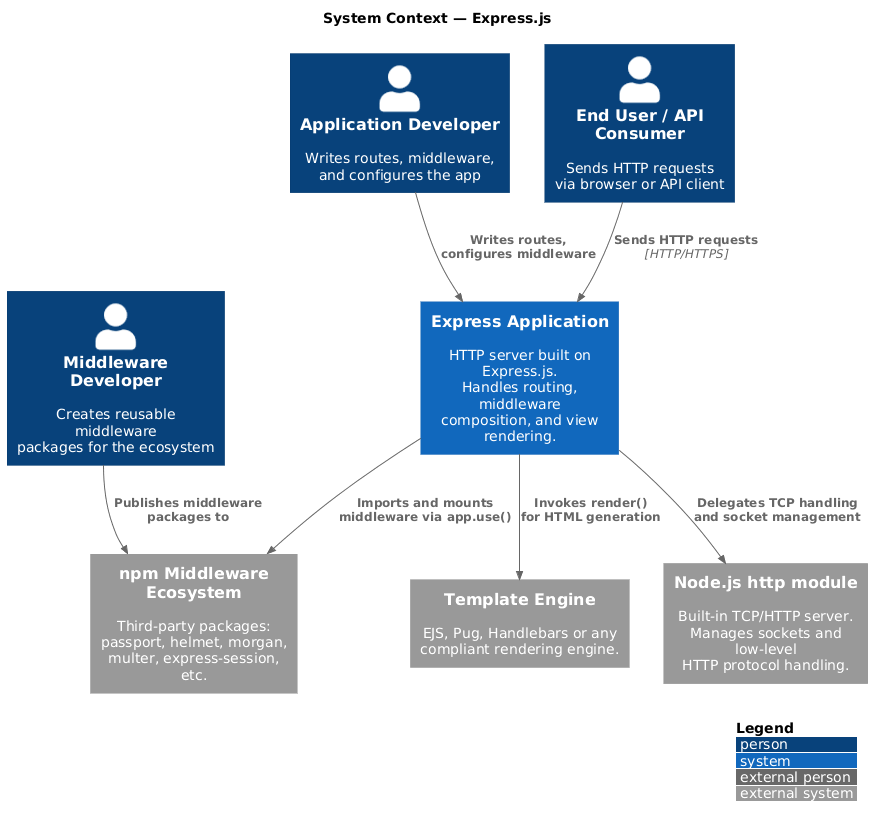
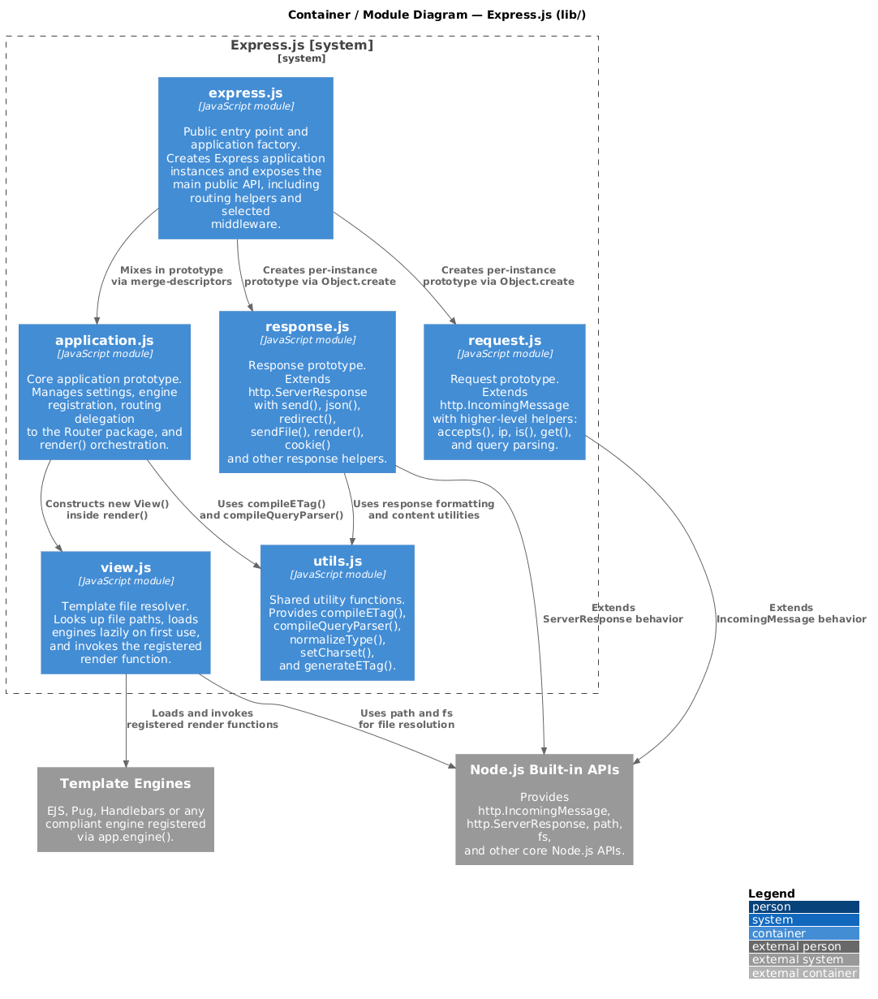
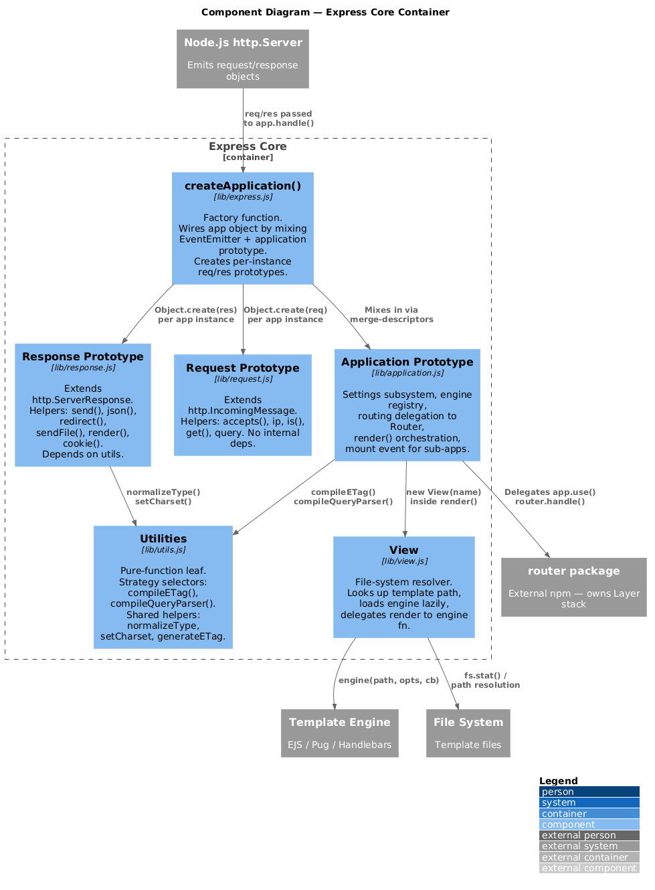

# Software Architecture — Express.js

Tooling used for C4 diagrams is PlantUML, and the diagrams are generated using the [PlantUML extension for Visual Studio Code](https://marketplace.visualstudio.com/items?itemName=jebbs.plantuml).

---

## 1. Context Level (C4 Level 1)

Express.js describes itself as a _"fast, unopinionated, minimalist web framework for Node.js"_. Rather than providing a full-stack application framework, Express offers a lightweight abstraction layer over Node.js' native HTTP APIs, introducing routing, middleware composition, request/response utilities, and view rendering support. Its minimalist philosophy prioritizes flexibility and extensibility, allowing developers to structure applications using external middleware and libraries instead of enforcing a predefined architectural model.

The framework is complemented by a broad ecosystem of third-party middleware packages that extend its core functionality with features such as authentication, logging, request parsing, session handling, and security mechanisms.

**Stakeholders:**

- **Application Developers** are the primary consumers of the Express API. They register routes, configure middleware, choose a view engine, and eventually call `app.listen()`. Express's ergonomics are designed around their workflow.
- **End Users / API Consumers** never interact with Express directly — they just send HTTP requests. Express is only visible to them through the behaviour of the application built on top of it (response times, error formats, cookie handling).
- **Middleware / Extension Developers** create reusable middleware components and extensions that integrate into the Express request/response processing pipeline, contributing to the extensibility of the ecosystem.

The key architectural decision visible at this level is **minimalism**: Express does not include a database layer, authentication system, WebSocket support, or session management. All of those must come from external packages, plugged in as middleware.

---

## 2. Container Level (C4 Level 2)

The diagram shows the six internal modules of Express.js (`lib/`) as containers within the Express.js system boundary, alongside the two external systems they depend on: **Node.js Built-in APIs** and **Template Engines**.

**`express.js`** is the public entry point and application factory. It creates Express application instances and exposes the main public API, including routing helpers and selected middleware. Every developer interaction starts here — calling `require('express')()` runs this module's `createApplication()` function.

**`application.js`** is the core orchestration module. It manages application settings, registers template engines, delegates routing to the external `router` package, and owns the `render()` algorithm. It depends on both `view.js` (for file resolution during rendering) and `utils.js` (for ETag and query parser compilation).

**`request.js`** extends Node.js's `IncomingMessage` behaviour. It augments the raw HTTP request object with higher-level helpers for content negotiation, IP resolution, header access, and query string parsing. It has no dependencies on other Express modules, making it a clean leaf in the internal graph.

**`response.js`** extends Node.js's `ServerResponse` behaviour. It is the richest module in the codebase, providing helpers for sending JSON, files, redirects, cookies, and rendered views. It depends on `utils.js` for response formatting and content utilities.

**`view.js`** handles template file resolution. It resolves the full file path from a view name, loads the registered render function lazily on first use, and invokes it. It depends only on Node.js built-ins (`path`, `fs`) and has no knowledge of other Express modules.

**`utils.js`** is a pure utility leaf with no internal dependencies. It provides shared helpers consumed by both `application.js` and `response.js`, including the Strategy-pattern selectors `compileETag()` and `compileQueryParser()`, and content-type utilities like `normalizeType()` and `setCharset()`.

The two external systems sit outside the Express boundary. **Node.js Built-in APIs** supply the raw `http.IncomingMessage` and `http.ServerResponse` objects that `request.js` and `response.js` extend. **Template Engines** (EJS, Pug, Handlebars, etc.) are loaded and invoked by `view.js` at render time.

### Relationship with Clean Architecture

Express does not follow Clean Architecture formally, but the mapping is recognisable:

| Clean Architecture Layer | Express Equivalent |
|---|---|
| Frameworks & Drivers | Node.js `http` module, template engines, `body-parser`, `serve-static` |
| Interface Adapters | `request.js` / `response.js` — translate raw Node.js objects into a higher-level API |
| Use Cases | `application.js` + `router` package — orchestrate the request-handling sequence |
| Entities / Domain | User-written route handlers — contain the actual business logic |

The **dependency rule** is broadly respected: `utils.js` and `view.js` are pure leaves with no reverse dependencies; `request.js` has no internal dependencies at all. The main deviation is that `application.js` acts simultaneously as a use-case orchestrator (managing the render lifecycle) and a framework-level configuration hub (settings, engine registry), blurring the boundary between the Interface Adapter and Use Case layers. In strict Clean Architecture these responsibilities would be split into separate objects.

---

## 3. Component Level (C4 Level 3)

This level zooms into the **Express Core** container (`lib/`), which is architecturally the most significant. The two other containers shown at Level 2 — **Node.js Built-in APIs** and **Template Engines** — are external systems whose source code lies outside the Express codebase; they are therefore not decomposed further at this level.

**`createApplication()` — Factory Component** (`lib/express.js`, lines 28–48)

This is the sole public entry point of the framework. It creates a bare function object, mixes in `EventEmitter.prototype` and the `application` prototype via `merge-descriptors`, and constructs per-instance `req` and `res` prototype objects using `Object.create`. The result is a single `app` object that is simultaneously a callable function (used as the Node.js `request` event handler), an event emitter, and an Express application. No other component creates `app` objects; this is the only path into the framework.

**Application Prototype — Orchestration Component** (`lib/application.js`)

This is the largest and most responsibility-heavy component. It holds four distinct sub-responsibilities:

- *Settings subsystem*: `app.set` / `app.get` / `app.enabled` / `app.disabled` — a simple key-value store for configuration.
- *Engine registry*: maps file extensions to render functions, populated via `app.engine(ext, fn)`.
- *Routing delegation*: `app.use`, `app.route`, and all HTTP verb shortcuts proxy to the `Router` instance, which is created lazily on first use.
- *Render orchestration*: `app.render()` implements the Template Method pattern — cache lookup → view construction via `View` → engine invocation.

Additionally, when a sub-application is mounted via `app.use(subApp)`, the child emits a `mount` event and inherits the parent's settings, enabling hierarchical application composition.

**Request Prototype — Adapter Component** (`lib/request.js`)

Extends Node.js's `http.IncomingMessage` via `Object.create`, adding higher-level helpers: `req.accepts()` for content negotiation, `req.ip` for proxy-aware IP resolution, `req.is()` for content-type checking, `req.get()` for header access, and `req.query` for parsed query strings. It has no internal dependencies on other Express components, making it a clean leaf in the dependency graph. The prototype is isolated per application instance — it does not bleed across multiple Express apps running in the same process.

**Response Prototype — Adapter Component** (`lib/response.js`)

Extends Node.js's `http.ServerResponse` via `Object.create`, providing the richest API surface in the codebase (1 047 lines, 12 external dependencies). Key methods: `res.send()` for generic response sending with automatic content-type detection, `res.json()` for JSON serialisation, `res.redirect()` for HTTP redirects, `res.sendFile()` for streaming file responses, `res.render()` for delegating to `app.render()`, and `res.cookie()` / `res.clearCookie()` for cookie management. It depends on `utils.js` for content-type normalisation and charset handling.

**Utilities — Leaf Component** (`lib/utils.js`)

A pure-function module with no internal dependencies. Implements the Strategy pattern for ETag generation (`compileETag`) and query string parsing (`compileQueryParser`): given a configuration value, each function returns a concrete algorithm function that is stored on the app and invoked at request time. Also provides shared helpers used by both `application.js` and `response.js`: `normalizeType`, `normalizeTypes`, `setCharset`, and `generateETag`.

**View — File Resolution Component** (`lib/view.js`)

Encapsulates all file-system concerns for template rendering: resolves the full file path (with `index.<ext>` fallback), loads engines lazily on first use via `require()`, and invokes the engine callback. It is constructed by `application.js` inside `app.render()` and has no knowledge of the application object or any other Express component, making it the most isolated module in the core.

### SOLID Violations at Level 3

**Single Responsibility Principle — partial violation in `application.js`**

`application.js` is responsible for four distinct concerns: settings management, engine registration, routing delegation, and render orchestration. While each responsibility is modest individually, their co-location in a single prototype means any of them changing requires touching the same file. In a stricter design, the settings subsystem and the render subsystem would be extracted into separate objects. That said, the absolute line count (631 lines) remains manageable, so this is a design smell rather than a critical flaw.

**Open/Closed Principle — fully satisfied**

The engine registry and the Strategy-based ETag/query parser allow behaviour to be extended without modifying Express source code. New template engines and custom ETag functions can be plugged in purely through configuration.

**Liskov Substitution Principle — fully satisfied**

`req` and `res` are valid behavioural subtypes of `http.IncomingMessage` and `http.ServerResponse` respectively. They add methods but do not override or weaken any existing Node.js contracts.

**Interface Segregation Principle — partial violation in `response.js`**

`response.js` is a single prototype object exposing 30+ methods spanning JSON responses, file downloads, redirects, cookie management, and content negotiation. A caller that only needs `res.json()` is still exposed to the entire surface. This is a pragmatic choice — one unified object is simpler to document and learn — but it inflates the interface beyond what any single client actually uses.

**Dependency Inversion Principle — fully satisfied**

`application.js` depends on the abstract ETag-function interface, not a concrete algorithm. The concrete strategy is injected at startup via `app.set('etag', 'weak')`, keeping the core decoupled from specific implementations.

---

## 4. Architectural Characteristics

### Simplicity and Learnability

The most important architectural quality of Express is conceptual simplicity. The entire programming model can be summarised in one sentence: requests pass through an ordered stack of middleware functions. There is no prescribed directory structure, no dependency injection container, and no lifecycle annotations. This deliberate lack of opinion is what made Express the dominant Node.js framework for over a decade and why it remains the reference framework taught in most Node.js courses. The cost of this simplicity is that teams must make and enforce their own architectural decisions — a burden that scales poorly for large teams.

### Extensibility

Extensibility is achieved through two orthogonal mechanisms: the middleware chain (open-ended behavioural composition) and the engine registry (plug-in rendering). Neither requires modifying Express source code. The extraction of the `router` package in Express 5 adds a third dimension: the routing engine itself can in principle be replaced. All three mechanisms satisfy the Open/Closed Principle at the architectural level.

### Performance

Express adds minimal overhead above raw Node.js: a prototype chain lookup on `req`/`res`, and a linear scan of the middleware stack on every request. The linear scan is the main performance bottleneck — it is O(n) in the number of registered layers. For high-throughput scenarios this is measurable: Fastify, which uses a radix-tree router and schema-based serialisation, consistently outperforms Express on synthetic benchmarks by a factor of 2–4×. Express accepts this trade-off in exchange for simplicity. The Strategy-based ETag and query parser compilation is one concrete optimisation that eliminates per-request branching on configuration values.

### Reliability and Error Handling

Express defines a four-argument middleware signature `(err, req, res, next)` for error handlers, creating a separate error-propagation channel within the same middleware stack. When any handler calls `next(err)`, the router skips normal handlers and delegates to the nearest downstream error handler. The key improvement in Express 5 over Express 4 is automatic catching of rejected promises in async middleware: in Express 4, an unhandled promise rejection in a route handler would crash the process; Express 5 forwards it to `next(err)` automatically, closing a long-standing reliability gap.

### Cohesion and Coupling

Each module has high cohesion: `view.js` handles only template file resolution; `utils.js` handles only low-level HTTP utilities; `request.js` handles only incoming message augmentation. The dependency graph is acyclic with no circular imports, which is the strongest structural indicator of low coupling. The exception is `application.js`, which aggregates multiple responsibilities and depends on both `view.js` and `utils.js` — making it the highest-coupling node in the graph. Despite this, it remains manageable because both of its internal dependencies are pure leaves with no reverse edges.
