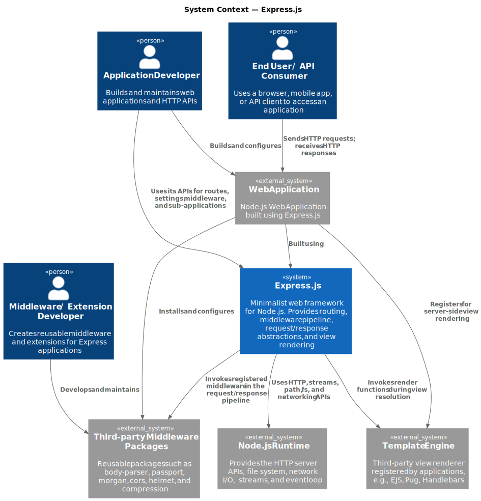

# Software Architecture — Express.js

Tooling used for C4 diagrams is PlantUML, and the diagrams are generated using the [PlantUML extension for Visual Studio Code](https://marketplace.visualstudio.com/items?itemName=jebbs.plantuml).

## 1. Context Level (C4 Level 1)

Express.js describes itself as a _"fast, unopinionated, minimalist web framework for Node.js"_. Rather than providing a full-stack application framework, Express offers a lightweight abstraction layer over Node.js’ native HTTP APIs, introducing routing, middleware composition, request/response utilities, and view rendering support. Its minimalist philosophy prioritizes flexibility and extensibility, allowing developers to structure applications using external middleware and libraries instead of enforcing a predefined architectural model.

The framework is complemented by a broad ecosystem of third-party middleware packages that extend its core functionality with features such as authentication, logging, request parsing, session handling, and security mechanisms.

**Stakeholders:**

- **Application Developers** are the primary consumers of the Express API. They register routes, configure middleware, choose a view engine, and eventually call `app.listen()`. Express's _ergonomics_ are designed around their workflow.
- **End Users / API Consumers** never interact with Express directly, they just send HTTP requests. Express is only visible to them through the behavior of the application built on top of it (response times, error formats, cookie handling).
- **Middleware / Extension Developers** create reusable middleware components and extensions that integrate into the Express request/response processing pipeline, contributing to the extensibility of the ecosystem.

The key architectural decision visible at this level is **minimalism**: Express does not include a database layer, authentication system, WebSocket support, or session management. All of those must come from external packages, plugged in as middleware. 

## 2. Container Level (C4 Level 2)

## 3. Component Level (C4 Level 3)

## 4. Architectural Characteristics