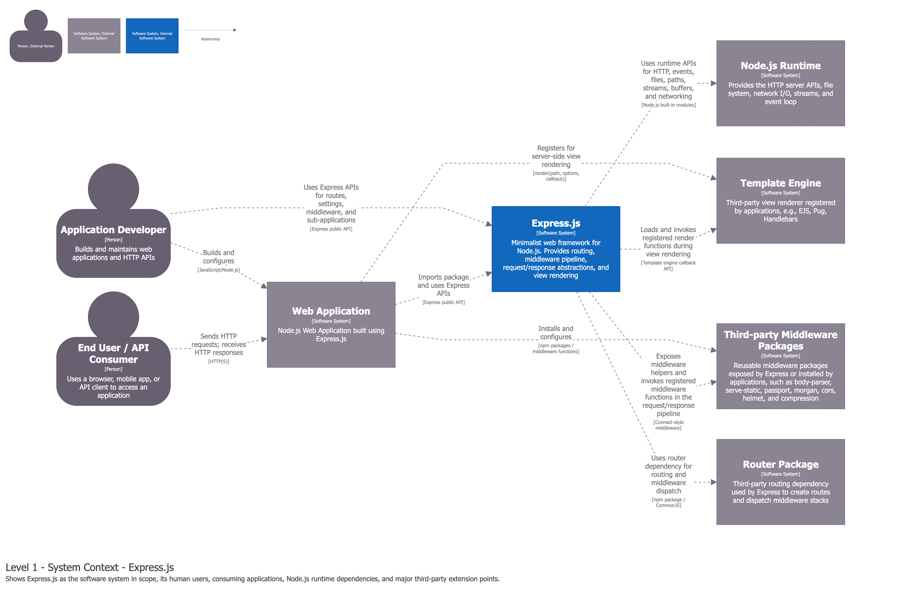
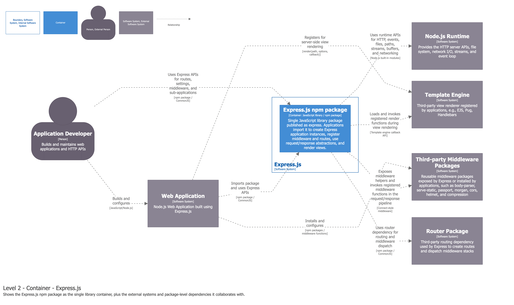
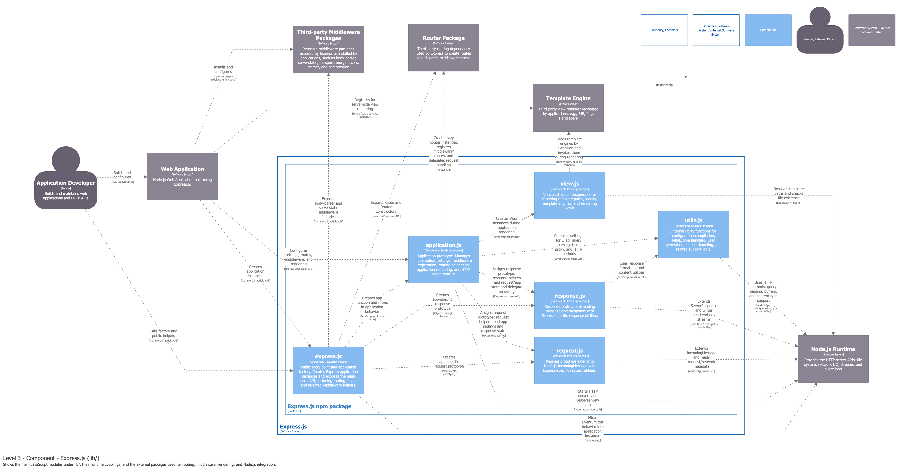

# Software Architecture — Express.js

## 1. Context Level (C4 Level 1)

Express.js describes itself as a _"fast, unopinionated, minimalist web framework for Node.js"_. Rather than providing a full-stack application framework, Express offers a lightweight abstraction layer over Node.js’ native HTTP APIs, introducing routing, middleware composition, request/response utilities, and view rendering support. Its minimalist philosophy lets developers structure applications with external middleware and libraries instead of enforcing a predefined architectural model.

A broad ecosystem of third-party middleware adds authentication, logging, request parsing, session handling, and security mechanisms.

**Stakeholders:**

- **Application Developers** are the primary consumers of the Express API. They register routes, configure middleware, choose a view engine, and eventually call `app.listen()`. Express's _ergonomics_ are designed around their workflow.
- **End Users / API Consumers** never interact with Express directly, they just send HTTP requests. Express is only visible to them through the behavior of the application built on top of it (response times, error formats, cookie handling).

The key architectural decision visible at this level is **minimalism**: Express does not include a database layer, authentication system, WebSocket support, or session management. All of those must come from external packages, plugged in as middleware.

## 2. Container Level (C4 Level 2)

At the container level, Express.js must be interpreted differently from a conventional deployable software system. Express is not an application composed of independently deployable containers such as a web server, database, worker, cache, or message broker. It is a Node.js library that is installed as an npm package and executed inside the runtime of another application.

For this reason, the Express.js npm package represents the whole internal container boundary in the C4 model. The deployable unit is the application built by developers using Express, not Express itself. Express contributes the framework code that runs inside that application process: the application factory, routing and middleware delegation, request and response extensions, utility functions, and view rendering support.

The end user is purposefully removed from this level because they do not directly interact with Express. End users interact with the deployed application or API over HTTP, while Express remains an internal library used by that application.

Therefore, the container view is not expanded into internal deployable containers. Any database, authentication provider, static asset store, external middleware package, reverse proxy, or template engine belongs outside the Express.js library boundary, either in the consuming application or surrounding ecosystem.

## 3. Component Level (C4 Level 3)

The third level of the C4 model dives inside the logical container of Express.js to map the actual building blocks of the library. The analysis at this level focuses **exclusively on the modules present in the source code** of the repository (`lib/` directory and `index.js` entry point), namely the six files that make up the framework: `express.js`, `application.js`, `request.js`, `response.js`, `utils.js`, and `view.js`.

The end user is also purposefully omitted from the component view for the same reason: no component in the Express codebase is directly called by an end user. Requests may originate from users, but they reach Express only through the consuming Node.js application and its HTTP server integration.

Dependencies resolved through npm — such as the `router` package (which exposes `Router`, `Route`, and `Layer`), `body-parser`, `serve-static`, `accepts`, `send`, and the other modules listed in `package.json` — are treated as **external systems** at the component boundary and are not mapped as internal components.

### Key Component Identification

The internal components identified from the source code analysis are:

1. **Express Factory** (`lib/express.js`): The factory module and public entry point of the library.
2. **Application** (`lib/application.js`): The global application facade.
3. **Request** (`lib/request.js`): The semantic extension of `http.IncomingMessage`.
4. **Response** (`lib/response.js`): The semantic extension of `http.ServerResponse`.
5. **Utils** (`lib/utils.js`): The cross-cutting utility module with settings compilation functions.
6. **View** (`lib/view.js`): The handler for template path resolution and rendering engine integration.

### Component Diagram

### Component Table and Responsibilities

The following table maps each logical component to its physical source file and architectural responsibilities.

| Component | Source File | Technology | Architectural Responsibilities |
| :-- | :-- | :-- | :-- |
| **Express Factory** | `lib/express.js` | JavaScript | Entry point of the library. Exposes the `createApplication()` function, analyzed as a [Factory pattern](Design.md#factory-pattern), which: (1) creates a function-object `app` capable of acting as a `(req, res, next)` callback for `http.createServer`; (2) applies the `EventEmitter` prototype and the `Application` prototype to the `app` object via `merge-descriptors`; (3) initializes instance-specific `request` and `response` prototypes via `Object.create()`; (4) invokes `app.init()` to bootstrap the configuration. It also re-exports public references to the prototypes (`exports.application`, `exports.request`, `exports.response`), the external Router constructors (`exports.Router`, `exports.Route`), and the built-in middleware (`json`, `urlencoded`, `raw`, `text`, `static`). |
| **Application** | `lib/application.js` | JavaScript | Main application facade (Facade Pattern). Accumulates five macro-responsibilities: (1) _Settings management_ through a key-value store (`app.set()`, `app.get()`, `app.enable()`, `app.disable()`); (2) _HTTP server lifecycle_ via `app.listen()`, which creates an `http.Server` and delegates listening; (3) _Router proxy_ for middleware registration (`app.use()`) and HTTP route definition (`app.get()`, `app.post()`, `app.all()`, `app.route()`, `app.param()`); (4) _View rendering management_ via `app.render()`, which instantiates the `View` component and invokes the template engine; (5) _Request dispatch_ via `app.handle()`, which mutates the `req`/`res` prototypes, sets up `res.locals`, and delegates to the Router. The Router is initialized with lazy-loading: the instance is created only upon the first access to `this.router`. It also supports hierarchical sub-application composition via `app.use(subApp)`, with settings and prototype inheritance from the parent app through the `mount` event. |
| **Request** | `lib/request.js` | JavaScript | Extends `http.IncomingMessage.prototype` via `Object.create()`. Defines explicit methods for HTTP header access (`req.get()` / `req.header()`) with special handling of the `Referer`/`Referrer` field, and for content negotiation (`req.accepts()`, `req.acceptsEncodings()`, `req.acceptsCharsets()`, `req.acceptsLanguages()`), delegating to the `accepts` npm library. Exposes dynamic getters defined via `Object.defineProperty` for derived request properties: `req.query` (delegating to the app-configured query parser), `req.protocol`, `req.secure`, `req.ip`, `req.ips`, `req.subdomains`, `req.path`, `req.host`, `req.hostname`, `req.fresh`, `req.stale`, `req.xhr`. Many of these getters depend on the application's `trust proxy` setting to determine correct behavior behind a reverse proxy. It also provides `req.is()` for `Content-Type` type-checking (via the `type-is` library) and `req.range()` for parsing the `Range` header (via `range-parser`). The file also defines the private utility `defineGetter()`, an internal helper function used to concisely create getter properties on the prototype object. |
| **Response** | `lib/response.js` | JavaScript | Extends `http.ServerResponse.prototype` via `Object.create()`. It is the largest component in the codebase. Exposes a fluent (chainable) API for building and sending HTTP responses, organized into several functional areas: (1) _Status and header management_: `res.status()` with strict status code validation, `res.set()`/`res.header()` with auto-charset for `Content-Type` via `mime-types`, `res.get()`, `res.append()`, `res.vary()`, `res.links()`, `res.location()`, `res.type()`/`res.contentType()`; (2) _Body serialization and sending_: `res.send()` which automatically handles Buffer conversion, `Content-Length` calculation, `ETag` generation (delegating to the `etag fn` function compiled by the `Utils` module), freshness handling (304 status), and header stripping for 204/304/205; `res.json()` which serializes objects to JSON with support for HTML character escaping (internal `stringify` function); `res.jsonp()` with JSONP support and callback sanitization; (3) _File transfer_: `res.sendFile()` which uses the `send` library for efficient stream-based transfer, and the private `sendfile()` helper function which manages stream events (`directory`, `end`, `error`, `file`, `stream`) and the transfer lifecycle; `res.download()` which sets `Content-Disposition` and delegates to `sendFile()`; `res.attachment()`; (4) _Cookies_: `res.cookie()` with serialization via the `cookie` library, signed cookie support (`cookie-signature`), `maxAge`/`expires` handling; `res.clearCookie()`; (5) _Redirects_: `res.redirect()` with content negotiation (text/HTML) and deprecation support; (6) _Template rendering_: `res.render()` which delegates to `app.render()` with `res.locals` merging; (7) _Content negotiation_: `res.format()` which selects the response format based on the request's `Accept` header and `req.accepts()`, using `normalizeType()`/`normalizeTypes()` from the `Utils` module, with a `default` fallback and 406 Not Acceptable; `res.sendStatus()` which combines status and text body. |
| **Utils** | `lib/utils.js` | JavaScript | Cross-cutting utility module consumed internally by `Application` and `Response`. Exposes three **app settings compilation functions**, each implementing a Strategy pattern to translate a user configuration value into an executable function: (1) `compileETag(val)`: accepts `true`/`'weak'`/`'strong'`/`false` or a custom function and returns an ETag generator (created by the private `createETagGenerator()` factory which delegates to the `etag` npm library); (2) `compileQueryParser(val)`: accepts `true`/`'simple'`/`'extended'`/`false` or a custom function; `simple` mode delegates to the native `node:querystring` module, `extended` mode to the private `parseExtendedQueryString()` function based on the `qs` library; (3) `compileTrust(val)`: accepts `true`/a number (hop count)/a string (IP)/an array of addresses or a custom function, delegating to `proxyaddr.compile()` for trusted proxy address validation. It also exposes: `normalizeType(type)` and `normalizeTypes(types)` for normalizing file extensions into full MIME types (via `mime-types`), used by `res.format()`; `setCharset(type, charset)` for inserting the charset into the `Content-Type` (via the `content-type` library), used by `res.send()`; `exports.methods`, the list of supported HTTP methods (derived from `node:http.METHODS`) used by `Application` to dynamically generate the proxy methods `app.get()`, `app.post()`, etc. The module also contains the private `acceptParams(str)` function for parsing Accept parameters with quality values (`q`). |
| **View** | `lib/view.js` | JavaScript / Node.js fs | Represents the abstraction of a single template file on disk. The `View(name, options)` constructor resolves the file extension, dynamically loads the corresponding rendering engine via `require(mod)` (looking for the module's `.__express` property), and stores the engine in the `opts.engines[ext]` cache to avoid repeated `require()` calls. The `View.prototype.lookup(fileName)` method scans the directories configured in `views` to locate the requested file, supporting both direct paths (`<path>.<ext>`) and index paths (`<path>/index.<ext>`). The `View.prototype.resolve(dir, file)` method checks for file existence on disk via the private `tryStat()` function (which wraps `fs.statSync()` in a try-catch). The `View.prototype.render(options, callback)` method invokes the loaded engine and normalizes synchronous callbacks by forcing asynchronous execution via `process.nextTick()`, thus preventing _Zalgo_-type issues (mixing synchronous and asynchronous code in the same callback flow). |

### 3.3. SOLID Principles Analysis

- **Single Responsibility Principle (SRP)**:
  - `view.js` (OK) is cleanly responsible only for template file resolution and engine delegation.
  - `utils.js` (OK) is focused on utility functions and strategy compilation.
  - `express.js` (OK) is focused solely on factory wiring and public API re-export.
  - `application.js` (VIOLATION) handles configuration management, middleware registration, routing delegation, template engine registration, rendering pipeline and HTTP server creation (through `app.listen()`). The mixing of server management with application logic represents a concentration of responsibilities.
  - `response.js` (VIOLATION) with more than 1000 lines of code and 12 external dependencies, handles status codes, headers, cookies, content negotiation, JSON serialization, file streaming, redirects, and view rendering delegation. The breadth of responsibilities and external dependencies suggests that it could be refactored into smaller, more focused components.
- **Open/Closed Principle (OCP)**:
  The middleware pipeline is an exemplary implementation of OCP, allowing Express's behavior to be extended indefinitely without modifying the core framework. Developers can add new middleware via `app.use()`. Template engines are pluggable via `app.engine()`, following the [Template Method pattern](Design.md#template-method-pattern), so that new engines can be registered without changing the view component. The [Strategy pattern](Design.md#strategy-pattern) in `utils.js` allows custom ETag generators, query parsers, and trust-proxy functions.
- **Liskov Substitution Principle (LSP)**:
  `request.js` and `response.js` create prototypes from `http.IncomingMessage.prototype` and `http.ServerResponse.prototype`, preserving compatibility with Node's native HTTP APIs. Express request and response objects can therefore be used interchangeably with native Node.js objects in middleware and route handlers, adhering to LSP.
- **Interface Segregation Principle (ISP)**:
  Both `request.js` and `response.js` expose many methods on their prototypes, which may violate ISP. `application.js` also exposes a large API surface for configuration and middleware management, more than some users need. However, Express favors a convenient unified API over smaller, more focused interfaces.
- **Dependency Inversion Principle (DIP)**:
  Express applies DIP selectively. At the framework-extension level, it depends on simple behavioral contracts: middleware functions, template engine callbacks, ETag functions, query parser functions, and trust-proxy functions. These allow users to inject behavior without changing Express internals.
  However, lower-level modules such as `response.js` and `request.js` directly depend on concrete packages including `send`, `cookie`, `content-disposition`, `accepts`, `type-is`, `fresh`, and `proxy-addr`. These are reasonable implementation choices, but not abstracted behind replaceable interfaces. Express therefore demonstrates good DIP at public extension points, while its internal request/response implementation remains coupled to concrete libraries.

## 4. Architectural Characteristics

### 4.1 Extensibility

Extensibility is the dominant architectural characteristic of Express.js. The middleware pipeline architecture, based on the [Chain of Responsibility pattern](Design.md#chain-of-responsibility-pattern), allows virtually unlimited functional extension without modifying Express's core code. Developers can inject authentication, logging, CORS handling, rate limiting, and any other functionality simply by adding middleware functions.

### 4.2 Simplicity and Minimalism

The entire library consists of only six source files. The deliberate minimalism (or "unopinionated" design) means that Express provides just enough structure to build web applications, without dictating application architecture nor including features that may not be universally needed. The trade-off is that developers must assemble their own architectural stack, which can lead to inconsistency across projects, but they gain maximum flexibility in how they structure their applications.

### 4.3 Performance

Several design decisions target performance:

- Lazy Router initialization avoids allocating routing structures until they are needed.
- The `Object.setPrototypeOf()` approach for request and response enrichment avoids wrapper overhead, allowing Express's request and response objects to be used directly with native Node.js APIs.
- The [Strategy pattern](Design.md#strategy-pattern) in `utils.js` compiles configuration into optimized functions at boot time rather than evaluating conditions on every request.
- `response.js` uses direct `Buffer` operations for Content-Length calculation.

### 4.4 Modularity and Coupling

Express.js shows a deliberately small internal module structure, but it is not isolated from its surrounding ecosystem. Its modularity is based less on many internal components and more on the delegation of specialized responsibilities to external npm packages and to user-provided middleware.

Coupling can be analyzed in two directions:

- **Efferent coupling (Ce)** measures outgoing dependencies: the modules or packages that Express depends on.
- **Afferent coupling (Ca)** measures incoming dependencies: the applications, middleware, and ecosystem packages that depend on Express.

At the package level, Express has high efferent coupling. The analyzed version depends on many runtime npm packages, including `router`, `body-parser`, `serve-static`, `accepts`, `send`, `cookie`, `mime-types`, `finalhandler`, and `proxy-addr`. This is not accidental: Express follows the Node.js ecosystem style of composing small packages instead of implementing every HTTP-related detail internally. The architectural advantage is that responsibilities such as MIME lookup, content negotiation, static file transfer, cookie serialization, proxy address parsing, and final error handling are delegated to focused libraries. The trade-off is that Express becomes sensitive to the correctness, security, and compatibility of those dependencies.

At the same time, Express has extremely high afferent coupling at the ecosystem level. Many applications and middleware packages depend on its public API: `express()`, `app.use()`, `app.get()`, `req`, `res`, middleware signatures, and routing behavior. This makes Express a stable but relatively immovable framework. Even small behavioral changes can break existing applications, which explains why compatibility and conservative evolution are important architectural constraints for the project.

Inside the `lib/` directory, the [dependency graph](Design.md#code-dependency-graph) is small and mostly acyclic:

| Module           | Main internal outgoing dependencies  | Main external dependencies                                                                           |
| :--------------- | :----------------------------------- | :--------------------------------------------------------------------------------------------------- |
| `express.js`     | `application`, `request`, `response` | `body-parser`, `merge-descriptors`, `router`, `serve-static`                                         |
| `application.js` | `view`, `utils`                      | `finalhandler`, `debug`, `router`, `once`, Node `http`                                               |
| `request.js`     | None                                 | `accepts`, `type-is`, `fresh`, `range-parser`, `parseurl`, `proxy-addr`                              |
| `response.js`    | `utils`                              | `send`, `cookie`, `mime-types`, `statuses`, `http-errors`, `content-disposition`, `vary`, and others |
| `utils.js`       | None                                 | `etag`, `qs`, `proxy-addr`, `mime-types`, `content-type`                                             |
| `view.js`        | None                                 | `debug`, Node `fs` and `path`, dynamically loaded template engines                                   |

This structure should not be described as a simple star centered only on the Express Factory. `express.js` is the composition entry point, corresponding to the [Factory pattern](Design.md#factory-pattern): it creates the application function, attaches the `Application` prototype, creates the request and response prototypes, and re-exports public middleware and constructors. However, most runtime behavior is concentrated in `application.js` and `response.js`. Therefore, a more accurate interpretation is that Express has a small composition root (`express.js`) and two operationally central modules: `application.js`, which coordinates routing, settings, rendering, and dispatch; and `response.js`, which implements most response-side HTTP behavior.

The most decoupled modules are `request.js`, `utils.js`, and `view.js` from an internal perspective, because they do not import other Express modules. `utils.js` and `view.js` can be understood almost independently. `request.js` is internally independent too, although at runtime it still reads application settings through `req.app`. The most coupled modules are `application.js` and `response.js`, because they connect the public Express API to multiple internal and external mechanisms.

The architectural impact is mixed but coherent. High external coupling increases dependency risk, but it also keeps the core framework small. High incoming coupling from the ecosystem limits how aggressively Express can evolve, but it also demonstrates that the public abstractions are stable and widely reusable.

### 4.5 Cohesion

Cohesion measures how strongly the responsibilities inside a module belong together. A highly cohesive module has one clear reason to exist; a weakly cohesive module groups several responsibilities mainly because they are convenient to expose through the same object.

The most cohesive component is `view.js`. Its functions all support one goal: resolving a template name into a file path and invoking the selected rendering engine. The constructor resolves the extension and loads the engine, `lookup()` searches the configured view directories, `resolve()` checks the concrete file path, and `render()` delegates to the engine while normalizing callback behavior. All of these operations belong to the same rendering-support responsibility.

`request.js` also has good cohesion. It extends Node's `http.IncomingMessage` with request-oriented semantic helpers: header access, content negotiation, type checking, range parsing, freshness checks, host and protocol resolution, subdomain extraction, and proxy-aware IP handling. The module contains many methods, but they all describe or interpret the incoming HTTP request. Its cohesion is therefore informational: the operations are different, but they are all centered on the same data object, `req`.

`response.js` has broader but still recognizable cohesion. Its methods all operate on the outgoing HTTP response, including status codes, headers, body serialization, JSON and JSONP responses, cookies, redirects, file transfer, content negotiation, and rendering delegation. This is a single conceptual area, but a very large one. For this reason, `response.js` is cohesive from the user's point of view, because developers naturally expect response helpers on `res`, but it is less cohesive from an implementation point of view because it combines several separable sub-responsibilities in one large prototype.

`utils.js` has moderate cohesion. It is not a domain object like `Request`, `Response`, or `View`; instead, it is a support module. Its functions compile app settings into executable strategies (`compileETag`, `compileQueryParser`, `compileTrust`) and provide HTTP-related helpers such as MIME normalization and charset insertion. These utilities are related by their role as internal support for `application.js` and `response.js`, but they are not all part of one narrow functional task.

`application.js` has the weakest cohesion. It is the framework facade and therefore deliberately gathers many responsibilities: default configuration, settings storage, router initialization, middleware registration, route registration, mounted sub-application handling, request dispatch, view rendering, template engine registration, and HTTP server creation through `app.listen()`. Architecturally, this makes the public API convenient and compact, but it also concentrates unrelated reasons for change in one module.

This cohesion profile is consistent with Express's design priorities. The framework optimizes for a small and ergonomic public surface rather than strict internal separation. `app`, `req`, and `res` are intentionally broad objects because they are the main programming interface exposed to developers. The cost is that some modules, especially `application.js` and `response.js`, are harder to reason about and refactor than smaller single-purpose components.

## 5. Conclusion

Express.js achieves wide applicability through a deliberately small core. The C4 analysis shows that Express should not be interpreted as a complete deployable system, but as a framework library embedded inside developer applications. Its main responsibility is to provide a stable HTTP abstraction layer over Node.js, centered on middleware composition, routing delegation, request and response extensions, configuration, and view rendering support.

At the component level, the framework is compact: the internal implementation is concentrated in a small number of source files. `express.js` acts as the composition entry point, while `application.js`, `request.js`, `response.js`, `utils.js`, and `view.js` provide the main behavioral areas. This compactness supports understandability and reinforces the minimalist identity of the framework, but it also means that some modules accumulate broad responsibilities. In particular, `application.js` and `response.js` act as central coordination points and therefore show weaker adherence to the Single Responsibility Principle than more focused modules such as `view.js`.

The design is strongly oriented toward extensibility. Middleware functions, pluggable template engines, configurable query parsers, ETag generators, and trust-proxy functions allow developers to extend or adapt behavior without modifying Express itself. This makes Express a good example of open extension through simple contracts, even though some internal modules remain directly coupled to concrete npm packages.

The coupling and cohesion analysis highlights the main architectural trade-off. Express keeps its internal codebase small by delegating specialized behavior to external packages, which improves modular reuse but increases dependency exposure. At the same time, its public API has very high incoming coupling because many applications depend on its behavior. This forces the framework to prioritize stability and backward compatibility. Internally, cohesion is strongest in narrow modules such as `view.js` and weaker in facade-style modules such as `application.js`, where API convenience is achieved by grouping several responsibilities together.

Overall, Express.js favors pragmatism over strict architectural purity. Its architecture is not perfectly separated into many small internal components, but it is coherent with its goals: minimalism, extensibility, compatibility with Node.js HTTP primitives, and a simple programming model for application developers. The result is a framework whose strength comes from a stable public surface and a flexible middleware ecosystem, while its main architectural risks come from concentrated responsibilities in central modules and reliance on external dependencies.
